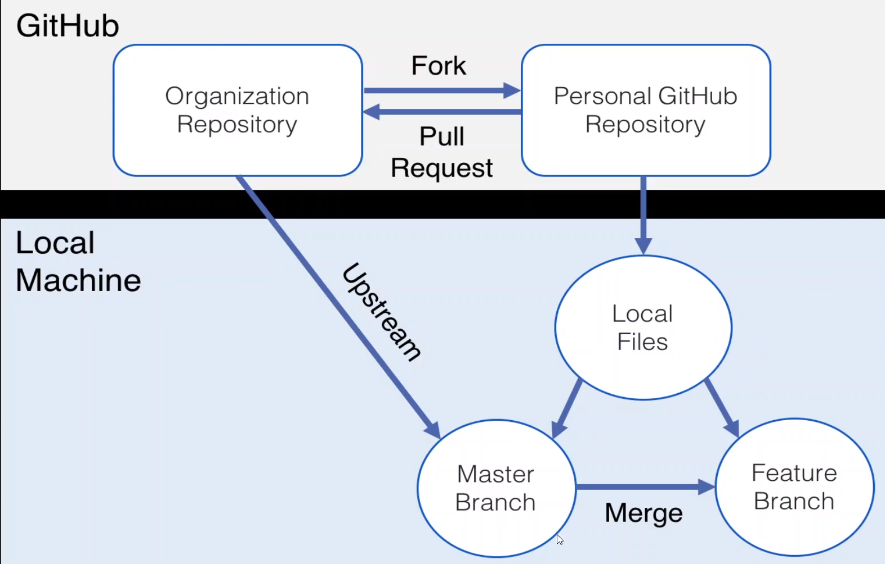

### View status of files
```git status```

### Stages

##### Stage 1 
**Move file/s from Working Directory to Staging Area file**

Moved specific file

```git add <file-name>```

Move all files

```git add .```

**Move file/s from Staging Area to Working Directory file (Initial Stage)**

Moved specific file

```git rm --cached <file-name>```

Move all files

```git rm --cached .```

**Move file/s from Staging Area to Working Directory file**

Moved specific file

```git rm --staged <file-name>```

Move all files

```git rm --staged .```

##### Stage 2

**Move files from Staging Area to Local Repository**

Note : Description -m is optional

```git commit -m "message for commit" -m "description of commit"```

<hr/>

### View committed Data 

It will show all the data from git Local Repository

```git log```

View All commit in one line format

```git log --oneline```

View All commit in one line with Graph

```git log --oneline --graph```

<hr/>

### Git Differance

Check changes between Working Area and Staging Area

```git diff```

Check changes between Staging Area and Repository Area

```git diff --staged```

Check changes between Working Area and Repository Area

```git diff head```

<hr/>

### How to GIT store the Data

+ GIT store the data in form of key and values 
+ Values is nothing but content of file
+ You give the values, and it will calculate a key from it, that is nothing but hash
+ GIT calculate the hashes with SHA1 algorithm

<hr/>

### GIT Branching 
In Git, branches are a part of your everyday development process. Git branches are effectively a pointer to a snapshot of your changes.

[Visualizing GIT](https://git-school.github.io/visualizing-git)

**Create New Branch**

```git branch <new-branch-name>```

**Change Branch**

```git checkout <branch-name>```

###### ```-b``` flag will create new branch and checkout to that branch

```git checkout -b <new-branch-name>```

**View All Branch**

```git branch```

**Rename the branch**

Checkout to that branch

```git branch -m <new-branch-name>```

**Delete the branch**

Checkout to other branch from the branch you want to delete

```git branch -d <branch-name>```

<hr/>

### GIT Merge

Checkout to target branch (branch on which you want to merge your changes)

```git merge <source-branch>``` 

( if no new commit on source branch it will do fast-forward merge )

( if new commit on source branch it will do recursive merge )

**Abort Merge** 

```git merge --abort```

### GIT Resolve conflict

1. open file/s on which conflict is occurred and decide which change you want keep from it.
2. add to staging area 
3. commit with message 

<hr/>

### GIT Rebase

+ Git rebase is one of the most powerful git command 
+ Rebasing is often used as alternative to merging
+ Rebasing a branch updates one branch with another branch by applying the commits of one branch on top of the commits of another branch
+ Git Rebase is used to clean up our local commit history
+ Merge preserve history, Rebase doesn't

**When not to use rebase**
+ The branch is public when it is shared to all the developers
+ Most of the teams prefers merger over rebase

**When to use rebase**
+ Cleaning up your commits before sharing your branch
+ Pulling changes from another branch without merge

```git rebase <branch-name>```

Eg : you have branch 

    branch 1
    branch 2

##### branch 2 commits
+ commit 2.1
+ commit 2.2

#### branch 1 commits
+ commit 1.1
+ commit 1.2

checkout to branch 1 

```git rebase branch-2```

    output
    + commit 2.1
    + commit 2.2
    + commit 1.1
    + commit 1.2

<hr/>

**Modify or Change the last or latest commit using amend command 

Eg: 
    
    file.text
    Bad WOrd
    
###### Committed

    file.text
    Goo Word

( If you want to add new change to previous commit) 

```git add . ```

```git commit --amend```

<hr/>

### Cherry Pick

Cherry Pick is used if you want to apply pericardial commit from one branch into another branch

Cherry Pick is mainly used if you don't want to merge the whole branch, and you want some commits

It causes duplicate commit

```git cherry-pick <commit-hash>```

### Git Reset 

+ Term reset itself stand for undo things 
+ Reset is often referred as confusing command
+ Rest does different things in different context
+ so that's why it is considered as complex command


###### Reset has options

+ --hard  : moved the files both to working area and staging area
+ --mixed : moved the files only to stage area ( default option )
+ --soft  : does not move the files

```git reset [option] [commit]```

### GIT Stash

The git stash command takes your uncommitted changes (both staged and unstated), saves them away for later use, and then reverts them from your working copy

**Stash the changes**

stash with default

```git stash```

stash with custom name

```git stash save <custom-name>```

**View Stash list**

```git stash list```

**Apply the stash changes** 

Remove stash from stack when pop

```git stash pop```

Don't remove stash from stack when apply

```git stash apply```

View changes before applying

```git shash show stash@{<id>}```

**Delete the stash**

Delete top stash and don't apply 

```git stash drop stash@{<id>}```

Delete all stash list

```git stash clear```

<hr/>

### GIT Revert

When your changes are push to remote and other developer pull the data in that case use revert

```git revert <commit-id>```

if branch is in local then use ```reset``` command

## GitHub

GitHub provide hosting platform for our repository

This provides that we can access the code from anywhere and also share the code with people around the world

GitHub is as service that hosts repositories in the cloud and makes it easier to collaborate with other people.

**Similar to GitHub :**
+ Gitlab
+ BitBucket
+ Gerrit


##### Git Clone

TO work with the remote repositories hosted in the gitHub we need to get the local copy into the computer

```git clone <remote-repository-url>```

##### GitHub Create Repository

* **Option 1 : Existing Repository**

   If you already have an existing repo locally that you want to get on GitHub
   1. Create New repo on GitHub
   2. Connect your local repo(add a remote)
   3. Push up your changes on GitHub

* **Option 2 : Start From Scrach** 
    
    If you haven't begun work on the local repo
    1. Create New repo on GitHub
    2. Clone it down to your machine
    3. Do some work locally
    4. Push your changes to GitHub


#### Git Remote

The git remote command lets you create, view, and delete connections to other repositories

**Remote List**

```git remote```

```git remote -v```

View remote branch

```git remote -r ```

**Add Remote to local repository**

```git remote add <remote-name> <url>```

**Rename remote name**

```git remote rename <old-name> <new-name>```

**Delete Remote**

```git remote remove <remote-name>```

**Push Code from local repository to remote repository**

```git push <remote-name> <branch-name>```

**What is Upstream** 

```-u ``` options allows us to set the upstream of the branch we are pushing

You can think of this as an link between the local branch to a branch in the gitHub

so that next time just type ```git push``` to push your changes 

### Git Fetch 

When you are working on with other collaborators on a gitHub repo.

One of your teammate has pushed up the changes to the master branch, but my local repo doesn't know!

The how do I get those changes ??

This is where  ```git fetch``` and ```git pull``` comes in play

```git fetch ``` and ```git pull``` get those changes from the gitHub repo to your local repo.

#### Git Fetch:

+ Download the data changes from remote repository
+ But those changes will not be automatically integrated to our working files
+ It just lets you see what others have been working in, without merging those changes into your local repo.

For fetching from all branch

```git fetch <remote-name>```

For fetching from specific branch

```git fetch <remote-name> <bramch>```

#### Git Pull:

+ Git pull is the command we can use to retrive changes from the remote repository
+ Unlike fetch, pull actually updates our HEAD branch with whatever changes are retrieved from the remote
+ In simple words we can say that
    Go and download data from github and immediately update my local repo with those changes

    Git Pull = Git Fetch + Git Merge

For pulling from all branch

```git pull <remote-name>```

For pulling from specific branch

```git fetch <remote-name> <bramch>```

### Pull Request 

Pull Request allow developer to alert team members to work that need to be reviewed

They provide a mechanism to approve or reject the work on a given branch

They also help facilitate discussion and feedback on the specifies commits

### Add Collaborators

    TODO // Need to add docs

### Git Branch Rule 

    TODO // Need to add docs

### Git Fork

    TODO // Need to add docs



### Git Tags 

Tags are pointers that refer to particular points in GIT history. We can mark a particular moment in time with a tag.

Tags are most often used to mark version releases in project ( v1.0,v2.0 ) 

Once a tag is created, it always refer to commit.

There are two type of Tag:
1. Lightweight Tag:

    Lightweight tag is much like a branch that doesn't change - it's just a pointer to commit

2. Annotated Tag : 

   Store extra metadata including the author's data
   Stored full objects in the git database

**Semantic Versioning**

Semantic versioning spec outlines a standardized versioning system for software releases.

It provides a consistent way for developers to give meaning to their software releases

See Version Meaning : 

      4   .   2   .   1

    Major   Minor   Patch 

Patch : Bug fix
Minor : New Features are added  ( Still backwards compatible withing Major release)
Major : Significant changes that is no longer backwards compatible. Features may be removed or changes substantially

### Lightweight Tag

**Create lightweight tag**

```git tag <tag>```

**Viewing Tags**

```git tag```

**View difference between tag**

```git diff <tag> <tag>```

**Search Tag**

```git tag -l "*beta*"```

**Checkout Particular tag**

```git checkout <tag>```


### **Annotated Tag**

**Create Annotated tag**

```git tag -a <tag>``` // write the message

**Viewing Annotated Tags info**

```git show <tag> ```

**Push Tag to GitHub**

Push specific tag

```git push <remote> <tag>```

Push all tag 

```git push origin --tags```

